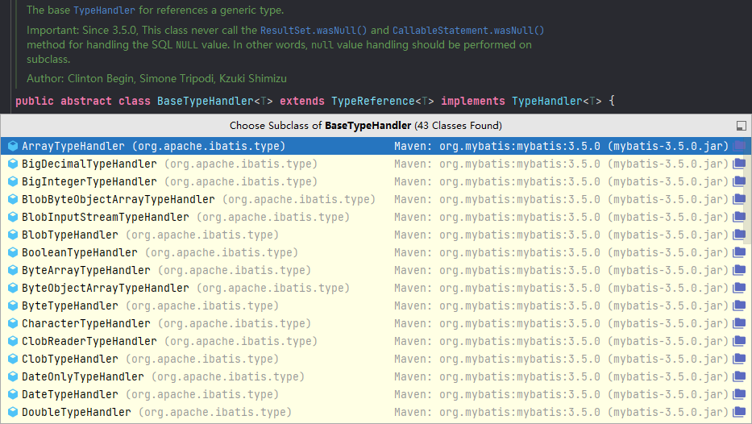
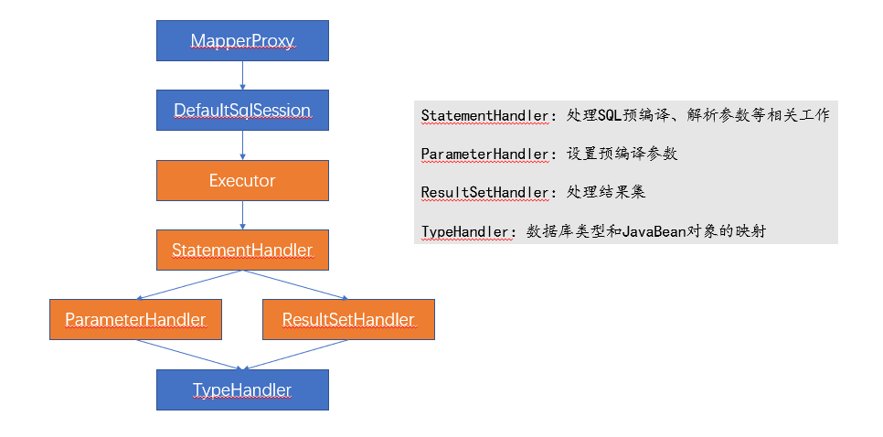

# MyBatis
Albrus learn how MyBatis works…φ(๑˃∀˂๑)♪

## 一、运行原理

```java
@Before
public void getConnection() throws IOException {
    String resource = "mybatis-config.xml";
    InputStream inputStream = Resources.getResourceAsStream(resource);
    sqlSessionFactory = new SqlSessionFactoryBuilder().build(inputStream);
    sqlSession = sqlSessionFactory.openSession();
}

@Test
public void getGames() {
    GameMapper mapper = sqlSession.getMapper(GameMapper.class);

    Game entity = mapper.get(1);
    System.out.println("ID: " + entity);

    List<Game> games1 = mapper.list();
    System.out.println("Count: " + games1.size());

    List<Game> games2 = sqlSession.selectList("com.deemo.hard.mapper.GameMapper.list");
    System.out.println("Count: " + games2.size());

    Game game = new Game();
    game.setName("Deemo");
    game.setPrice(32.0);
    game.setDescription("");
    Integer insert = mapper.insert(game);
    System.out.println("The insert id: " + insert);
}
```

1. `org.apache.ibatis.session.SqlSessionFactory sqlSessionFactory = new SqlSessionFactoryBuilder().build(inputStream);`

   通过各种解析器解析配置文件（`XMLConfigBuilder、XPathParser、XMLStatementBuilder、XMLMapperBuilder...`），返回 `DefaultSqlSessionFactory()` 对象

   ```java
   // org.apache.ibatis.builder.xml.XMLMapperBuilder#parse
   public void parse() {
       if (!configuration.isResourceLoaded(resource)) {
           // 1， 2 生成 MappedStatement
           configurationElement(parser.evalNode("/mapper"));
           configuration.addLoadedResource(resource);
           // 3 生成 MapperProxyFactory<T>
           bindMapperForNamespace();
       }
   }
   ```

   1. `XMLStatementBuilder` 解析 接口 中的SQL语句，将 #{param} 参数替换为 ? 并生成该参数的 `ParameterMapping`

      ```java
      // org.apache.ibatis.builder.xml.XMLStatementBuilder#parseStatementNode
      public void parseStatementNode() {
          // ...
          
          // Parse the SQL (pre: <selectKey> and <include> were parsed and removed)
          SqlSource sqlSource = langDriver.createSqlSource(configuration, context, parameterTypeClass);
          
          // ...
          
          // 下一小点的入口
          builderAssistant.addMappedStatement(..., sqlSource, ...);
      }
      
      // org.apache.ibatis.builder.SqlSourceBuilder.ParameterMappingTokenHandler#handleToken
      @Override
      public String handleToken(String content) {
          parameterMappings.add(buildParameterMapping(content));
          return "?";
      }
      ```

   2. 然后为 `Mapper` 中的每一个 **接口** 创建 `MappedStatement` 并缓存在 `Configuration.mappedStatements(StrictMap<String, MappedStatement>)`，`key` 便是 接口 的全路径，这里的 `StrictMap` 是 MyBatis 中自己继承 `HashMap<String, V>` 设计的一个 `Configuration` 内部类，其会在 `put` 元素时，截取全路径的最后一个 `.` 后的字符串做二次缓存（即接口的名称）

   3. 为每个 `Mapper` 创建一个 `MapperProxyFactory<T>` **代理工厂对象**缓存在 `Configuration.mapperRegistry.knownMappers(Map<Class<?>, MapperProxyFactory<?>>)` 中

2. `org.apache.ibatis.session.SqlSession sqlSession = sqlSessionFactory.openSession();`

   **返回 `DefaultSqlSession()` 对象，==包含 `Executor` 对象，四大对象之一==**，如果开启了**二级缓存**，`Executor` 对象会使用 `CachingExecutor` 包裹，默认 `ExecutorType = SIMPLE`，便是 `SimpleExecutor`，还会使用拦截器链增强

   ```java
   // org.apache.ibatis.session.defaults.DefaultSqlSessionFactory#openSessionFromDataSource
   private SqlSession openSessionFromDataSource(ExecutorType execType, TransactionIsolationLevel level, boolean autoCommit) {
       // ...
       
       final Executor executor = configuration.newExecutor(tx, execType);
       return new DefaultSqlSession(configuration, executor, autoCommit);
   
       // ...
   }
   
   // org.apache.ibatis.session.Configuration#newExecutor
   public Executor newExecutor(Transaction transaction, ExecutorType executorType) {
       executorType = executorType == null ? defaultExecutorType : executorType;
       executorType = executorType == null ? ExecutorType.SIMPLE : executorType;
       Executor executor;
       if (ExecutorType.BATCH == executorType) {
           executor = new BatchExecutor(this, transaction);
       } else if (ExecutorType.REUSE == executorType) {
           executor = new ReuseExecutor(this, transaction);
       } else {
           // 默认
           executor = new SimpleExecutor(this, transaction);
       }
       if (cacheEnabled) {
           executor = new CachingExecutor(executor);
       }
       
       // ==注意==，四大对象之一，并调用拦截器链增强
       executor = (Executor) interceptorChain.pluginAll(executor);
       return executor;
   }
   ```

3. `GameMapper mapper = sqlSession.getMapper(GameMapper.class);`

   获取 `Mapper` 对象时，在 `knownMappers` 中获取 `MapperProxyFactory<T>` 代理工厂对象并创建代理对象 `MapperProxy<T>`，是代理对象的 `InvocationHandler`，持有 `sqlSession、mapperInterface、methodCache` 信息

   ```java
   public class MapperProxy<T> implements InvocationHandler, Serializable {
       // ...
   }
   
   public class MapperProxyFactory<T> {
   
     private final Class<T> mapperInterface;
     private final Map<Method, MapperMethod> methodCache = new ConcurrentHashMap<>();
   
     @SuppressWarnings("unchecked")
     protected T newInstance(MapperProxy<T> mapperProxy) {
       // mapperProxy 便是代理对象的 InvocationHandler
       return (T) Proxy.newProxyInstance(mapperInterface.getClassLoader(), new Class[] { mapperInterface }, mapperProxy);
     }
   
     public T newInstance(SqlSession sqlSession) {
       // mapperProxy 便是代理对象的 InvocationHandler，持有 sqlSession、mapperInterface、methodCache 信息
       final MapperProxy<T> mapperProxy = new MapperProxy<>(sqlSession, mapperInterface, methodCache);
       return newInstance(mapperProxy);
     }
   
   }
   ```

4. `Game entity = mapper.get(1);`

   通过 `mapper` 代理对象增删查改数据库，进入 `MapperProxy<T>.invoke()` 方法，该方法创建并缓存 `MapperMethod` 对象，**`MapperMethod` 对象会解析接口方法是增删改查中的哪一种类型并通过调用持有 `sqlSession` 对象，通过 `sqlSession` 对象增删查改，`sqlSession` 底层便是通过持有的 `executor` 对象增删查改数据库**

   ```java
   // org.apache.ibatis.binding.MapperProxy#invoke
   @Override
   public Object invoke(Object proxy, Method method, Object[] args) throws Throwable {
       final MapperMethod mapperMethod = cachedMapperMethod(method);
       return mapperMethod.execute(sqlSession, args);
   }
   
   // org.apache.ibatis.binding.MapperMethod#execute
   public Object execute(SqlSession sqlSession, Object[] args) {
       // ...
       
       // 参数解析器：
       // 没有参数返回 null
       // 只有一个参数直接返回
       // 否则，使用 Map 包装参数（除了正常的参数名称外，还会放置 param1, param2, ...）
       Object param = method.convertArgsToSqlCommandParam(args);
       // selectOne 最终会到 selectList
       result = sqlSession.selectOne(command.getName(), param);
       
       // ...
   }
   ```

5. `org.apache.ibatis.session.defaults.DefaultSqlSession#selectList`

   ```java
   // org.apache.ibatis.session.defaults.DefaultSqlSession
   // #selectList(java.lang.String, java.lang.Object, org.apache.ibatis.session.RowBounds)
   @Override
   public <E> List<E> selectList(String statement, Object parameter, RowBounds rowBounds) {
       try {
           // 解析配置文件时，会为每一个 接口 创建 MappedStatement
           MappedStatement ms = configuration.getMappedStatement(statement);
           // 开启了二级缓存，便是被 CachingExecutor 包裹的 SimpleExecutor（默认 ExecutorType SIMPLE）
           return executor.query(ms, wrapCollection(parameter), rowBounds, Executor.NO_RESULT_HANDLER);
       } catch (Exception e) {
           throw ExceptionFactory.wrapException("Error querying database.  Cause: " + e, e);
       } finally {
           ErrorContext.instance().reset();
       }
   }
   ```

   1. `selectOne` 最终会到 `selectList`
   2. `statement` 为 接口 的全路径名，从缓存中获取 `MappedStatement` 对象，包含 接口 的详细信息

   3. 进入查询之前，还会包装一次参数：`wrapCollection(parameter)`，该参数包装便是处理集合类型，封装为 `Map` 结果，使用 `collection、list、array` 作为 Key，方便在 Mapper 中使用

6. `return executor.query(...)`

   ```java
   // org.apache.ibatis.executor.CachingExecutor#query
   @Override
   public <E> List<E> query(MappedStatement ms, Object parameterObject, RowBounds rowBounds, ResultHandler resultHandler) throws SQLException {
       // 1
       BoundSql boundSql = ms.getBoundSql(parameterObject);
       // 2
       CacheKey key = createCacheKey(ms, parameterObject, rowBounds, boundSql);
       // 3
       return query(ms, parameterObject, rowBounds, resultHandler, key, boundSql);
   }
   ```

   1. `BoundSql boundSql = ms.getBoundSql(parameterObject);`

      `BoundSql` 对象包含 SQL 的详细信息，其实就是从 `sqlSource` 对象中获取的信息

   2. 创建缓存 key：`-1289266733:86971797:com.deemo.hard.mapper.GameMapper.get:0:2147483647:SELECT * FROM ``game`` WHERE id = ?:1:dev`

   3. 进入二级缓存查询，查询缓存

      ```java
      // org.apache.ibatis.executor.CachingExecutor#query
      @Override
      public <E> List<E> query(MappedStatement ms, Object parameterObject, RowBounds rowBounds, ResultHandler resultHandler, CacheKey key, BoundSql boundSql)
          throws SQLException {
          Cache cache = ms.getCache();
          if (cache != null) {
              // ...
          }
          
          // 被包装的 Executor，默认 SimpleExecutor
          return delegate.query(ms, parameterObject, rowBounds, resultHandler, key, boundSql);
      }
      ```

7. 二级缓存中没有，进入被包装的 `SimpleExecutor` 中查询

   ```java
   // org.apache.ibatis.executor.BaseExecutor#query
   @Override
   public <E> List<E> query(MappedStatement ms, Object parameter, RowBounds rowBounds, ResultHandler resultHandler, CacheKey key, BoundSql boundSql) throws SQLException {
       if (closed) {
           throw new ExecutorException("Executor was closed.");
       }
       if (queryStack == 0 && ms.isFlushCacheRequired()) {
           clearLocalCache();
       }
       List<E> list;
       try {
           queryStack++;
           // 再从一级缓存中获取
           list = resultHandler == null ? (List<E>) localCache.getObject(key) : null;
           if (list != null) {
               // 一级缓存中存在
               handleLocallyCachedOutputParameters(ms, key, parameter, boundSql);
           } else {
               // 一级缓存中不存在
               list = queryFromDatabase(ms, parameter, rowBounds, resultHandler, key, boundSql);
           }
       } finally {
           queryStack--;
       }
       if (queryStack == 0) {
           for (DeferredLoad deferredLoad : deferredLoads) {
               deferredLoad.load();
           }
           // issue #601
           deferredLoads.clear();
           if (configuration.getLocalCacheScope() == LocalCacheScope.STATEMENT) {
               // issue #482
               clearLocalCache();
           }
       }
       return list;
   }
   ```

   再从一级缓存中获取，获取不到则从数据库中查询

8. `queryFromDatabase`

   ```java
   // org.apache.ibatis.executor.BaseExecutor#queryFromDatabase
   private <E> List<E> queryFromDatabase(MappedStatement ms, Object parameter, RowBounds rowBounds, ResultHandler resultHandler, CacheKey key, BoundSql boundSql) throws SQLException {
       List<E> list;
       // 一级缓存占位
       localCache.putObject(key, EXECUTION_PLACEHOLDER);
       try {
           // 从数据库中查询
           list = doQuery(ms, parameter, rowBounds, resultHandler, boundSql);
       } finally {
           // 清缓存？
           localCache.removeObject(key);
       }
       // 放缓存
       localCache.putObject(key, list);
       if (ms.getStatementType() == StatementType.CALLABLE) {
           localOutputParameterCache.putObject(key, parameter);
       }
       return list;
   }
   ```

   一级缓存先占位、再查询，最后存放缓存

   `finally` 中的清缓存操作猜测是怕查询出异常时影响缓存数据

9. `list = doQuery(ms, parameter, rowBounds, resultHandler, boundSql);`

   ```java
   // org.apache.ibatis.executor.SimpleExecutor#doQuery
   @Override
   public <E> List<E> doQuery(MappedStatement ms, Object parameter, RowBounds rowBounds, ResultHandler resultHandler, BoundSql boundSql) throws SQLException {
       // JDBC 原生对象
       Statement stmt = null;
       try {
           Configuration configuration = ms.getConfiguration();
           // ==注意==，四大对象之二，并调用拦截器链增强
           StatementHandler handler = configuration.newStatementHandler(wrapper, ms, parameter, rowBounds, resultHandler, boundSql);
           // 创建原生 Statement
           stmt = prepareStatement(handler, ms.getStatementLog());
           // 查询数据库
           return handler.query(stmt, resultHandler);
       } finally {
           closeStatement(stmt);
       }
   }
   ```
   
   1. ==`StatementHandler`，四大对象之二，并调用拦截器链增强==
   
      ```java
      // org.apache.ibatis.session.Configuration#newStatementHandler
      public StatementHandler newStatementHandler(Executor executor, MappedStatement mappedStatement, Object parameterObject, RowBounds rowBounds, ResultHandler resultHandler, BoundSql boundSql) {
          // 创建 StatementHandler
          StatementHandler statementHandler = new RoutingStatementHandler(executor, mappedStatement, parameterObject, rowBounds, resultHandler, boundSql);
          
          // 调用拦截器链增强
          statementHandler = (StatementHandler) interceptorChain.pluginAll(statementHandler);
          return statementHandler;
      }
      ```
   
      - `new RoutingStatementHandler(...)`
   
        ```java
        public RoutingStatementHandler(Executor executor, MappedStatement ms, Object parameter, RowBounds rowBounds, ResultHandler resultHandler, BoundSql boundSql) {
        
            switch (ms.getStatementType()) {
              case STATEMENT:
                delegate = new SimpleStatementHandler(...);
                break;
              case PREPARED:
                // statementType 默认 PREPARE
                delegate = new PreparedStatementHandler(...);
                break;
              case CALLABLE:
                delegate = new CallableStatementHandler(...);
                break;
              default:
                throw new ExecutorException("Unknown statement type: " + ms.getStatementType());
            }
        
          }
        ```
   
        `statementType` 默认值为：PREPARE，因此创建 `PreparedStatementHandler`
   
      - `new PreparedStatementHandler(...)`
   
        ```java
        public class PreparedStatementHandler extends BaseStatementHandler
        
        // org.apache.ibatis.executor.statement.PreparedStatementHandler#PreparedStatementHandler
        public PreparedStatementHandler(Executor executor, MappedStatement mappedStatement, Object parameter, RowBounds rowBounds, ResultHandler resultHandler, BoundSql boundSql) {
            super(executor, mappedStatement, parameter, rowBounds, resultHandler, boundSql);
        }
        
        // org.apache.ibatis.executor.statement.BaseStatementHandler#BaseStatementHandler
        protected BaseStatementHandler(Executor executor, MappedStatement mappedStatement, Object parameterObject, RowBounds rowBounds, ResultHandler resultHandler, BoundSql boundSql) {
            // ...
        
            if (boundSql == null) { // issue #435, get the key before calculating the statement
                generateKeys(parameterObject);
                boundSql = mappedStatement.getBoundSql(parameterObject);
            }
        
            this.boundSql = boundSql;
        
            // ==注意==，四大对象之三，并调用拦截器链增强
            this.parameterHandler = configuration.newParameterHandler(mappedStatement, parameterObject, boundSql);
            
            // ==注意==，四大对象之四，并调用拦截器链增强
            this.resultSetHandler = configuration.newResultSetHandler(executor, mappedStatement, rowBounds, parameterHandler, resultHandler, boundSql);
        }
        
        =============================================================================================
        
        // org.apache.ibatis.session.Configuration#newParameterHandler
        // ==注意==，四大对象之三，并调用拦截器链增强
        public ParameterHandler newParameterHandler(MappedStatement mappedStatement, Object parameterObject, BoundSql boundSql) {
            // 创建 ParameterHandler
            ParameterHandler parameterHandler = mappedStatement.getLang().createParameterHandler(mappedStatement, parameterObject, boundSql);
            
            // 调用拦截器链增强
            parameterHandler = (ParameterHandler) interceptorChain.pluginAll(parameterHandler);
            return parameterHandler;
        }
        
        // org.apache.ibatis.session.Configuration#newResultSetHandler
        // ==注意==，四大对象之四，并调用拦截器链增强
        public ResultSetHandler newResultSetHandler(Executor executor, MappedStatement mappedStatement, RowBounds rowBounds, ParameterHandler parameterHandler,
                                                    ResultHandler resultHandler, BoundSql boundSql) {
            // 创建 ResultSetHandler
            ResultSetHandler resultSetHandler = new DefaultResultSetHandler(executor, mappedStatement, parameterHandler, resultHandler, boundSql, rowBounds);
            
            // 调用拦截器链增强
            resultSetHandler = (ResultSetHandler) interceptorChain.pluginAll(resultSetHandler);
            return resultSetHandler;
        }
        ```
   
        ==在创建 `PreparedStatementHandler` 对象时，会创建四大对象之三：`ParameterHandler` 和四大对象之四：`ResultSetHandler`，并且会调用拦截器链增强，这两个对象都会被 `PreparedStatementHandler` 对象持有==
   
   2. 创建原生 `Statement stmt = prepareStatement(handler, ms.getStatementLog());`
   
      ```java
      // org.apache.ibatis.executor.SimpleExecutor#prepareStatement
      private Statement prepareStatement(StatementHandler handler, Log statementLog) throws SQLException {
          Statement stmt;
          // 获取连接
          Connection connection = getConnection(statementLog);
          // 创建原生 Statement
          stmt = handler.prepare(connection, transaction.getTimeout());
          // 设置参数
          handler.parameterize(stmt);
          return stmt;
      }
      ```
   
      - `stmt = handler.prepare(connection, transaction.getTimeout());`
   
        ```java
        // org.apache.ibatis.executor.statement.BaseStatementHandler#prepare
        @Override
        public Statement prepare(Connection connection, Integer transactionTimeout) throws SQLException {
            Statement statement = null;
            try {
                statement = instantiateStatement(connection);
                // ...
            } catch () {
                
            }
            // ...
        }
        
        // org.apache.ibatis.executor.statement.PreparedStatementHandler#instantiateStatement
        @Override
        protected Statement instantiateStatement(Connection connection) throws SQLException {
            String sql = boundSql.getSql();
            if (mappedStatement.getKeyGenerator() instanceof Jdbc3KeyGenerator) {
                String[] keyColumnNames = mappedStatement.getKeyColumns();
                if (keyColumnNames == null) {
                    return connection.prepareStatement(sql, PreparedStatement.RETURN_GENERATED_KEYS);
                } else {
                    return connection.prepareStatement(sql, keyColumnNames);
                }
            } else if (mappedStatement.getResultSetType() == ResultSetType.DEFAULT) {
                // 原生 JDBC 操作生成 Statement
                return connection.prepareStatement(sql);
            } else {
                return connection.prepareStatement(sql, mappedStatement.getResultSetType().getValue(), ResultSet.CONCUR_READ_ONLY);
            }
        }
        ```
   
        ==在 `PreparedStatementHandler#instantiateStatement` 中便会通过原生 JDBC 操作生成 `Statement`==
   
      - `handler.parameterize(stmt);`
   
        ```java
        // org.apache.ibatis.executor.statement.PreparedStatementHandler#parameterize
        @Override
        public void parameterize(Statement statement) throws SQLException {
            // ParameterHandler 四大对象之三
            parameterHandler.setParameters((PreparedStatement) statement);
        }
        
        // org.apache.ibatis.scripting.defaults.DefaultParameterHandler#setParameters
        @Override
        public void setParameters(PreparedStatement ps) {
            // ...
            typeHandler.setParameter(ps, i + 1, value, jdbcType);
        }
        ```
   
        `PreparedStatementHandler` 调用 `ParameterHandler` 设置参数，`ParameterHandler` 解析参数后调用各类型的 `TypeHandler<T>` 完成 JDBC `PreparedStatement` 参数设置
   
   3. 查询数据库 `return handler.query(stmt, resultHandler);`
   
      ```java
      // org.apache.ibatis.executor.statement.RoutingStatementHandler#query
      @Override
      public <E> List<E> query(Statement statement, ResultHandler resultHandler) throws SQLException {
          return delegate.<E>query(statement, resultHandler);
      }
      
      // org.apache.ibatis.executor.statement.PreparedStatementHandler#query
      @Override
      public <E> List<E> query(Statement statement, ResultHandler resultHandler) throws SQLException {
          PreparedStatement ps = (PreparedStatement) statement;
          ps.execute();
          // ==注意==，四大对象之四
          return resultSetHandler.handleResultSets(ps);
      }
      ```
   
      从 `Executor.doQuery` 到 `RoutingStatementHandler.query`  到 `PreparedStatementHandler.query`，最终使用 JDBC 原生 `PreparedStatement` 对象完成数据库查询，==最后使用四大对象之四 `ResultSetHandler` 完成对数据的封装==
   
10. `return resultSetHandler.handleResultSets(ps);`

   ```java
   // org.apache.ibatis.executor.resultset.DefaultResultSetHandler#handleResultSets
   @Override
   public List<Object> handleResultSets(Statement stmt) throws SQLException {
       // ...
   }
   
   private Object getPropertyMappingValue(ResultSet rs, MetaObject metaResultObject, ResultMapping propertyMapping, ResultLoaderMap lazyLoader, String columnPrefix)
       throws SQLException {
       // ...
       final TypeHandler<?> typeHandler = propertyMapping.getTypeHandler();
       final String column = prependPrefix(propertyMapping.getColumn(), columnPrefix);
       return typeHandler.getResult(rs, column);
       
       // ...
   }
   ```

   处理响应数据封装的时候，也会使用到 `TypeHandler<?>` 获取 Java Bean 对象对应属性该类型的值

11. 处理缓存、连接，流程结束



## 二、四大对象

1. `Executor`

   在 `sqlSessionFactory.openSession()` 时创建，被 `SqlSession` 持有：也就是说，每创建一个 `SqlSession` 便会创建一个 `Executor` 被 `SqlSession` 持有

2. `StatementHandler`

   在通过 `SqlSession` 获取到 `MapperProxy` 对象后调用接口时，最终会进入 `SqlSession` 的查询方法，也将最终调用 `Executor` 的 `doUpdate/doQuery` 方法，此时便会创建 `StatementHandler` 对象：也就是说，没调用一次接口，便会生成一个 `StatementHandler` 对象

3. `ParameterHandler`

   在创建 `StatementHandler` 对象的构造方法中被初始化创建，被 `StatementHandler` 持有

4. `ResultSetHandler`

   在创建 `StatementHandler` 对象的构造方法中被初始化创建，被 `StatementHandler` 持有

## 三、缓存

SqlSessionTemplate：
```java
// 开启事务后，初始化启动：
DataSourceTransactionManager.doBegin() {
    // ...省略
    if (txObject.isNewConnectionHolder()) {
        // TransactionSynchronizationManager.bindResource(obtainDataSource(), txObject.getConnectionHolder()):
        TransactionSynchronizationManager.bindResource() {
            // private static final ThreadLocal<Map<Object, Object>> resources = new NamedThreadLocal<>("Transactional resources");

            // ...省略
            Map<Object, Object> map = resources.get();
            // set ThreadLocal Map if none found
            if (map == null) {
                map = new HashMap<>();
                resources.set(map);
            }
            // 此时actualKey为连接池对象
            Object oldValue = map.put(actualKey, value);
        }
    }
}

// 当系统初始化启动时，会扫描mapper接口并创建 MapperProxy 对象：
// 此时会为每个mapper接口对象创建一个mapper代理对象（即 MapperProxy ：每个代理对象自身包含一个 SqlSession 对象（其实是 SqlSessionTemplate 对象，该对象中包含一个 SqlSessionFactory 对象））
public MapperProxy(SqlSession sqlSession, Class<T> mapperInterface, Map<Method, MapperMethod> methodCache) {
    this.sqlSession = sqlSession;
    this.mapperInterface = mapperInterface;
    this.methodCache = methodCache;
}

// 调用mapper接口的方法时，会携带该代理对象自带的 SqlSession 对象（其实是 SqlSessionTemplate 对象，该对象中包含一个 SqlSessionFactory 对象）
MapperMethod.execute(SqlSession, Object[]) {
    case UPDATE: {
        Object param = method.convertArgsToSqlCommandParam(args);
        result = rowCountResult(sqlSession.update(command.getName(), param));
        break;
    }
}

// sqlSession.update(command.getName(), param)，此 sqlSession 其实是 SqlSessionTemplate 对象
// TODO 此处是 sqlSessionProxy 动态代理接管，待深入学习代理后再详细写原理
// ~~断点调试时，若调试进入这一步，会自动触发调用 SqlSessionUtils.getSqlSession(SqlSessionFactory, ExecutorType, PersistenceExceptionTranslator)，~~
// ~~此时无 holder， 会通过 sessionFactory 创建一个真正的 SqlSession，若开启了事务，会将 SqlSession 存放到 TransactionSynchronizationManager.resources() 中~~
SqlSessionTemplate.update(String, Object) {
    // 调用真正 sqlSession代理对象
    return this.sqlSessionProxy.update(statement, parameter);
}

// 接上部分
// sqlSession代理对象，内部类：
SqlSessionTemplate.SqlSessionInterceptor.invoke() {
    SqlSession sqlSession = getSqlSession(
        // SqlSessionTemplate。this：调用者的 SqlSessionTemplate 对象
        // 开启事务时，sqlSessionFactory 后续作为 resources（ThreadLocal）的 key 获取 holder
        SqlSessionTemplate.this.sqlSessionFactory,
        SqlSessionTemplate.this.executorType,
        SqlSessionTemplate.this.exceptionTranslator);
}

SqlSessionUtils.getSqlSession(SqlSessionFactory, ExecutorType, PersistenceExceptionTranslator) {
    // 从 resources（ThreadLocal） 中获取holder，key 为 sessionFactory
    SqlSessionHolder holder = (SqlSessionHolder) TransactionSynchronizationManager.getResource(sessionFactory);
    
    SqlSession session = sessionHolder(executorType, holder);
    if (session != null) {
      return session;
    }

    // 若 session 为null，new 一个 DefaultSqlSession 对象
    LOGGER.debug(() -> "Creating a new SqlSession");
    session = sessionFactory.openSession(executorType);

    // 若开启事务，将 session 存放到 resources（ThreadLocal），key 为 sessionFactory
    registerSessionHolder(sessionFactory, executorType, exceptionTranslator, session);
}

```

一级缓存：
针对同一个sqlSession
```java
当未开启事务时、或开启事务但未执行更新操作时，一级缓存生效：
org.apache.ibatis.executor.BaseExecutor.localCache(PerpetualCache) 

BaseExecutor.query(MappedStatement, Object, RowBounds, ResultHandler, CacheKey, BoundSql) {
    // ...省略
    
    // 先从一级缓存中获取，key 与 mapper 相关
    list = resultHandler == null ? (List<E>) localCache.getObject(key) : null;
    if (list != null) {
        handleLocallyCachedOutputParameters(ms, key, parameter, boundSql);
    } else {
        // 缓存中获取不到，查询数据库
        list = queryFromDatabase(ms, parameter, rowBounds, resultHandler, key, boundSql);
        /*List<E> BaseExecutor.queryFromDatabase(MappedStatement, Object parameter, RowBounds, ResultHandler, CacheKey key, BoundSql) {
            List<E> list;
            localCache.putObject(key, EXECUTION_PLACEHOLDER);
            try {
                list = doQuery(ms, parameter, rowBounds, resultHandler, boundSql);
            } finally {
                localCache.removeObject(key);
            }
            // 将查询数据放入缓存中
            localCache.putObject(key, list);
            if (ms.getStatementType() == StatementType.CALLABLE) {
                localOutputParameterCache.putObject(key, parameter);
            }
            return list;
        }*/
    }
}

当开启事务时：
在每次更新操作后，会清空缓存：
BaseExecutor.update(MappedStatement, Object parameter) {
    // ...省略
    
    clearLocalCache();
    /*@Override
    public void clearLocalCache() {
        if (!closed) {
          localCache.clear();
          localOutputParameterCache.clear();
        }
    }*/
}
```
